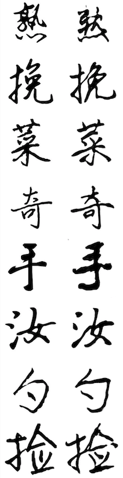
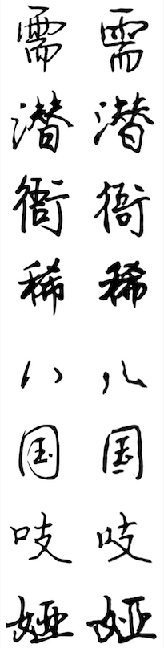
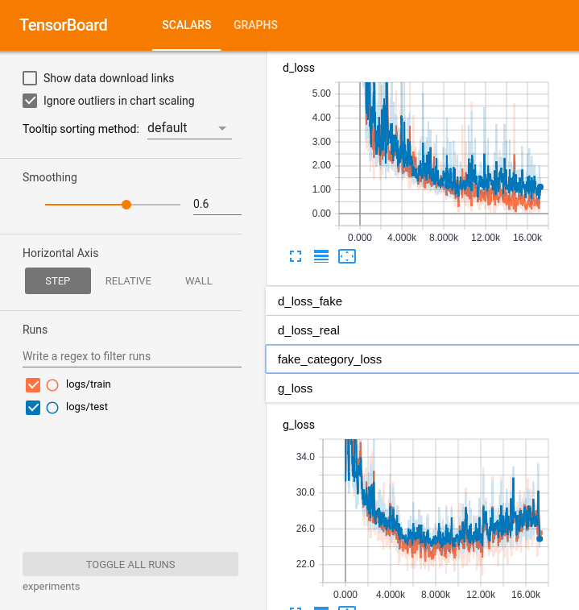
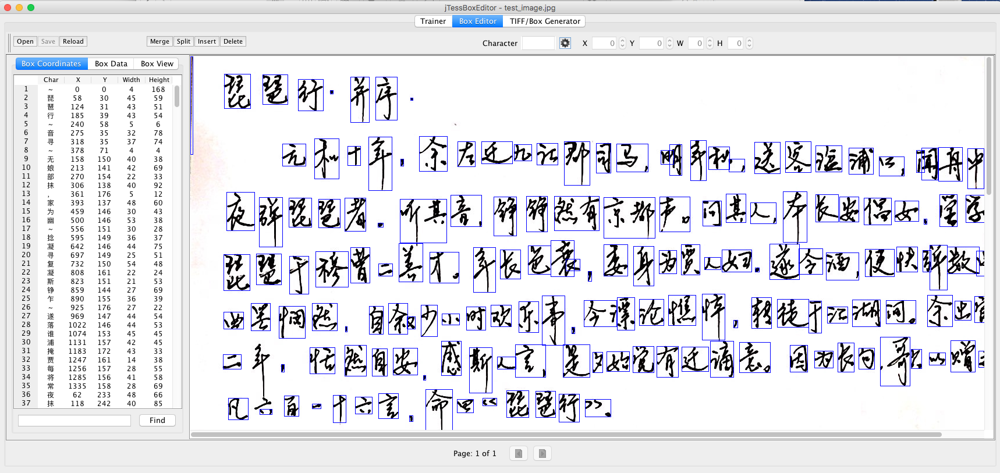

# zi2zi (forked): Master Chinese Calligraphy with Conditional Adversarial Networks

## Major Updates from Original repo:
* We all know GAN can generate **printed fonts** very well based on original repo, so we are curious how well can GAN learn on **handwritten fonts**. And whether it can learn our handwriting styles via finetuning.
* Use Grayscale images which largely improves the training speed
* Provide **training data** and preprocess script to prepare them
* **Generate handwritten Chinese characters based on your own handwritings!!!** An OCR toolkit based on Tesseract and jTessBoxEditor, which allows you to take a picture of your handwritings and use it as finetuning data
* Script to finetune handwritings and learn the style within few shots


## Experiment Results

Below are the screenshot of GAN-generated samples at Step 9000. The left side is the ground truth, and the right side is the GAN-generated samples for a given font. You can tell the conditional GAN did learn some stylistic features of a given font.

<p align="center">
  
</p>

<p align="center">
  
</p>


After model starts training, you can see samples and logs under `experiments/` folder.

Here is a screenshot of the tensorboard, and according to validation error, Step 9000 is the recommended stop point for given training data. (You can add more hand-written fonts as training data, so as to train the model longer, **but one recommendation is: don't overfit**, otherwise the finetuning won't work). 

<p align="center">
  
</p>


## Requirements
* Python 3
* Tensorflow 1.8


## Usage
You can follow the steps below or simply run `run.sh` 

```
##########################
## PreProcess
##########################

# Sample draw the fonts and save to paired_images, about 10-20 mins
PYTHONPATH=. python font2img.py


##########################
## Train and Infer
##########################

# Train the model
PYTHONPATH=. python train.py --experiment_dir=experiments \
                --experiment_id=0 \
                --batch_size=64 \
                --lr=0.001 \
                --epoch=40 \
                --sample_steps=50 \
                --schedule=20 \
                --L1_penalty=100 \
                --Lconst_penalty=15

# Infer
PYTHONPATH=. python infer.py --model_dir=experiments/checkpoint/experiment_0_batch_32 \
                --batch_size=32 \
                --source_obj=experiments/data/val.obj \
                --embedding_ids=0 \
                --save_dir=save_dir/
```

To see how to prepare the **your handwrittings**, please take a look at [handwriting_preparation/README.md](), which introduces how to use tesseract and jTessBoxEditor for details.

<p align="center">
  
</p>

```
##########################
## Finetune
##########################

# Generate paired images for finetune
PYTHONPATH=. python font2img_finetune.py


# Train/Finetune the model
PYTHONPATH=. python train.py --experiment_dir=experiments_finetune \
                --experiment_id=0 \
                --batch_size=16 \
                --lr=0.001 \
                --epoch=10 \
                --sample_steps=1 \
                --schedule=20 \
                --L1_penalty=100 \
                --Lconst_penalty=15 \
                --freeze_encoder_decoder=1 \
                --optimizer=sgd \
                --fine_tune=67 \
                --flip_labels=1

PYTHONPATH=. python infer.py --model_dir=experiments_finetune/checkpoint/experiment_0 \
                --batch_size=32 \
                --source_obj=experiments_finetune/data/val.obj \
                --embedding_id=67 \
                --save_dir=save_dir/


PYTHONPATH=. python infer_by_text.py --model_dir=experiments_finetune/checkpoint/experiment_0 \
                --batch_size=32 \
                --embedding_id=67 \
                --save_dir=save_dir/
```


## Related Projects
My feeling is CycleGan will perform better, as it doesn't require pairwise data, and supposedly can learn more abstractive structural features of fonts.
You can take a look at [Generating Handwritten Chinese Characters using CycleGAN](https://arxiv.org/pdf/1801.08624.pdf) and its implementation at [https://github.com/changebo/HCCG-CycleGAN](https://github.com/changebo/HCCG-CycleGAN)

#
####################################################################
#########  Below are the README from original repo author ########
###################################################################
#

## Introduction
Learning eastern asian language typefaces with GAN. zi2zi(字到字, meaning from character to character) is an application and extension of the recent popular [pix2pix](https://github.com/phillipi/pix2pix) model to Chinese characters.

Details could be found in this [**blog post**](https://kaonashi-tyc.github.io/2017/04/06/zi2zi.html).

## Network Structure
### Original Model


The network structure is based off pix2pix with the addition of category embedding and two other losses, category loss and constant loss, from [AC-GAN](https://arxiv.org/abs/1610.09585) and [DTN](https://arxiv.org/abs/1611.02200) respectively.

### Updated Model with Label Shuffling


After sufficient training, **d_loss** will drop to near zero, and the model's performance plateaued. **Label Shuffling** mitigate this problem by presenting new challenges to the model. 

Specifically, within a given minibatch, for the same set of source characters, we generate two sets of target characters: one with correct embedding labels, the other with the shuffled labels. The shuffled set likely will not have the corresponding target images to compute **L1\_Loss**, but can be used as a good source for all other losses, forcing the model to further generalize beyond the limited set of provided examples. Empirically, label shuffling improves the model's generalization on unseen data with better details, and decrease the required number of characters.

You can enable label shuffling by setting **flip_labels=1** option in **train.py** script. It is recommended that you enable this after **d_loss** flatlines around zero, for further tuning.

## Gallery
### Compare with Ground Truth

<p align="center">

</p>

### Brush Writing Fonts
<p align="center">

</p>

### Cursive Script (Requested by SNS audience)
<p align="center">

</p>


### Mingchao Style (宋体/明朝体)
<p align="center">

</p>

### Korean
<p align="center">

</p>

### Interpolation
<p align="center">
  
</p>

### Animation
<p align="center">
  
  
</p>

<p align="center">
  
</p>


## How to Use
### Step Zero
Download tons of fonts as you please
### Requirement
* Python 2.7
* CUDA
* cudnn
* Tensorflow >= 1.0.1
* Pillow(PIL)
* numpy >= 1.12.1
* scipy >= 0.18.1
* imageio

### Preprocess
To avoid IO bottleneck, preprocessing is necessary to pickle your data into binary and persist in memory during training.

First run the below command to get the font images:

```sh
python font2img.py --src_font=src.ttf
                   --dst_font=tgt.otf
                   --charset=CN 
                   --sample_count=1000
                   --sample_dir=dir
                   --label=0
                   --filter=1
                   --shuffle=1
```
Four default charsets are offered: CN, CN_T(traditional), JP, KR. You can also point it to a one line file, it will generate the images of the characters in it. Note, **filter** option is highly recommended, it will pre sample some characters and filter all the images that have the same hash, usually indicating that character is missing. **label** indicating index in the category embeddings that this font associated with, default to 0.

After obtaining all images, run **package.py** to pickle the images and their corresponding labels into binary format:

```sh
python package.py --dir=image_directories
                  --save_dir=binary_save_directory
                  --split_ratio=[0,1]
```

After running this, you will find two objects **train.obj** and **val.obj** under the save_dir for training and validation, respectively.

### Experiment Layout
```sh
experiment/
└── data
    ├── train.obj
    └── val.obj
```
Create a **experiment** directory under the root of the project, and a data directory within it to place the two binaries. Assuming a directory layout enforce bettet data isolation, especially if you have multiple experiments running.
### Train
To start training run the following command

```sh
python train.py --experiment_dir=experiment 
                --experiment_id=0
                --batch_size=16 
                --lr=0.001
                --epoch=40 
                --sample_steps=50 
                --schedule=20 
                --L1_penalty=100 
                --Lconst_penalty=15
```
**schedule** here means in between how many epochs, the learning rate will decay by half. The train command will create **sample,logs,checkpoint** directory under **experiment_dir** if non-existed, where you can check and manage the progress of your training.

### Infer and Interpolate
After training is done, run the below command to infer test data:

```sh
python infer.py --model_dir=checkpoint_dir/ 
                --batch_size=16 
                --source_obj=binary_obj_path 
                --embedding_ids=label[s] of the font, separate by comma
                --save_dir=save_dir/
```

Also you can do interpolation with this command:

```sh
python infer.py --model_dir= checkpoint_dir/ 
                --batch_size=10
                --source_obj=obj_path 
                --embedding_ids=label[s] of the font, separate by comma
                --save_dir=frames/ 
                --output_gif=gif_path 
                --interpolate=1 
                --steps=10
                --uroboros=1
```

It will run through all the pairs of fonts specified in embedding_ids and interpolate the number of steps as specified. 

### Pretrained Model
Pretained model can be downloaded [here](https://drive.google.com/open?id=0Bz6mX0EGe2ZuNEFSNWpTQkxPM2c) which is trained with 27 fonts, only generator is saved to reduce the model size. You can use encoder in the this pretrained model to accelerate the training process.
## Acknowledgements
Code derived and rehashed from:

* [pix2pix-tensorflow](https://github.com/yenchenlin/pix2pix-tensorflow) by [yenchenlin](https://github.com/yenchenlin)
* [Domain Transfer Network](https://github.com/yunjey/domain-transfer-network) by [yunjey](https://github.com/yunjey)
* [ac-gan](https://github.com/buriburisuri/ac-gan) by [buriburisuri](https://github.com/buriburisuri)
* [dc-gan](https://github.com/carpedm20/DCGAN-tensorflow) by [carpedm20](https://github.com/carpedm20)
* [origianl pix2pix torch code](https://github.com/phillipi/pix2pix) by [phillipi](https://github.com/phillipi)

## License
Apache 2.0

